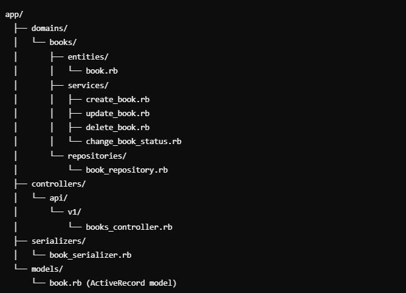

# rails-DDD

# **Bookstore Inventory Management API**

This is a demo API for managing a bookstore's inventory, built using **Ruby on Rails** following **Domain-Driven Design (DDD)** principles. The API provides endpoints for adding, updating, deleting, and changing the status of books in the inventory.

---

## **Project Setup**

### **Requirements**

- Ruby 3.x
- Rails 7.x
- PostgreSQL

### **Installation**

1.  **Clone the repository:**

- 1 - `git clone https://github.com/yourusername/bookstore_api.git`
- 2 - `cd bookstore_api`

2.  **Install dependencies:**

- 1 - `bundle install`

3.  **Set up the database:**

Make sure PostgreSQL is running and configured correctly.

- 1 - `rails db:create`
- 2 - `rails db:migrate`

4.  **Run the server:**

- 1 - `rails server`

The API will now be running at `http://localhost:3000`.

---

## **API Endpoints**

### **1. Get All Books**

**Endpoint**: `/api/v1/books`  
**Method**: `GET`

`curl -X GET http://localhost:3000/api/v1/books`

**Response**:

```json
[
  {
    "id": 1,
    "title": "Clean Code",
    "author": "Robert C. Martin",
    "price": "29.99",
    "stock": 10,
    "status": "active",
    "description": "A Handbook of Agile Software Craftsmanship."
  }
]
```

### **2. Get a Single Book**

**Endpoint**: `/api/v1/books/:id`  
**Method**: `GET`

`curl -X GET http://localhost:3000/api/v1/books/1`

**Response**:

```json
{
  "id": 1,
  "title": "Clean Code",
  "author": "Robert C. Martin",
  "price": "29.99",
  "stock": 10,
  "status": "active",
  "description": "A Handbook of Agile Software Craftsmanship."
}
```

### **3. Create a New Book**

**Endpoint**: `/api/v1/books`  
**Method**: `POST`

`curl -X POST http://localhost:3000/api/v1/books \
  -H "Content-Type: application/json" \
  -d '{
    "book": {
      "title": "The Pragmatic Programmer",
      "author": "Andy Hunt, Dave Thomas",
      "price": "34.99",
      "stock": 15,
      "status": "active",
      "description": "Your journey to mastery."
    }
  }'`

**Response**:

```json
{
  "id": 2,
  "title": "The Pragmatic Programmer",
  "author": "Andy Hunt, Dave Thomas",
  "price": "34.99",
  "stock": 15,
  "status": "active",
  "description": "Your journey to mastery."
}
```

### **4. Update a Book**

**Endpoint**: `/api/v1/books/:id`  
**Method**: `PUT`

`curl -X PUT http://localhost:3000/api/v1/books/1 \
  -H "Content-Type: application/json" \
  -d '{
    "book": {
      "price": "24.99",
      "stock": 5
    }
  }'`

**Response**:

```json
{
  "id": 1,
  "title": "Clean Code",
  "author": "Robert C. Martin",
  "price": "24.99",
  "stock": 5,
  "status": "active",
  "description": "A Handbook of Agile Software Craftsmanship."
}
```

### **5. Change Book Status**

**Endpoint**: `/api/v1/books/:id/change_status`  
**Method**: `PATCH`

`curl -X PATCH http://localhost:3000/api/v1/books/1/change_status \
  -H "Content-Type: application/json" \
  -d '{"status": "inactive"}'`

**Response**:

```json
{
  "message": "Book status updated successfully"
}
```

### **6. Delete a Book**

**Endpoint**: `/api/v1/books/:id`  
**Method**: `DELETE`

`curl -X DELETE http://localhost:3000/api/v1/books/1`

**Response**:

```json
{
  "message": "Book deleted successfully"
}
```

---

## **Project Structure and Domain-Driven Design (DDD)**

This project is organized according to Domain-Driven Design (DDD) principles, where the domain is the central concern. The goal is to separate business logic from infrastructure and application concerns.

Here’s how the folders are structured:



### **1. `app/domains/books/`**

This folder contains all the business logic related to the **Book** entity, including services, repositories, and the entity itself. This structure allows each domain to evolve independently without mixing concerns.

- **`entities/`**: Defines the core domain objects, such as the `Book` entity, which represent the business concepts.
- **`services/`**: Contains classes responsible for handling the business logic. For example, services like `CreateBook`, `UpdateBook`, and `ChangeBookStatus` handle specific actions related to books.
- **`repositories/`**: Abstracts the data access layer. For example, `BookRepository` interacts with the database to fetch, create, update, or delete records.

### **2. `app/controllers/`**

The controller layer manages API endpoints and user interactions. It doesn’t contain any business logic. Instead, it delegates requests to the services located in `app/domains/`.

### **3. `app/serializers/`**

Serializers are used to structure the data returned by the API. For example, the `BookSerializer` ensures that only the required attributes of the `Book` entity are exposed to the API consumers.

---

## **Why Use Domain-Driven Design (DDD)?**

DDD allows for clear separation of concerns, making the application more modular, testable, and scalable. Each component (e.g., entities, services, repositories) is designed to fulfill a specific role, improving both maintainability and flexibility.

### **Key Benefits:**

- **Business Logic Separation**: By keeping business logic inside services, it becomes easier to modify without touching other parts of the application.
- **Modularity**: Each domain (in this case, `Book`) has its own isolated folder structure, meaning new features or entities can be added without disrupting the existing code.
- **Testability**: Services and repositories can be tested independently without relying on controllers or the database.

---

## **How to Add More Resources**

To extend this API and manage additional entities (such as `Authors`, `Customers`, etc.), follow these steps:

1.  **Create the Model**: Generate the model and migration using the `rails generate model` command.
2.  **Define Domain Structure**: Create the necessary folders in `app/domains/`:

    - **entities** for the core domain object.
    - **services** to handle business logic.
    - **repositories** to interact with the database.

3.  **Create API Endpoints**: Add routes to `config/routes.rb` and generate a controller to expose the required endpoints.
4.  **Write Serializers**: Create a serializer in `app/serializers/` to structure the API response.

By following these steps, you can continue to build the API while adhering to DDD principles.

---

## **License**

This project is licensed under the MIT License.

---
